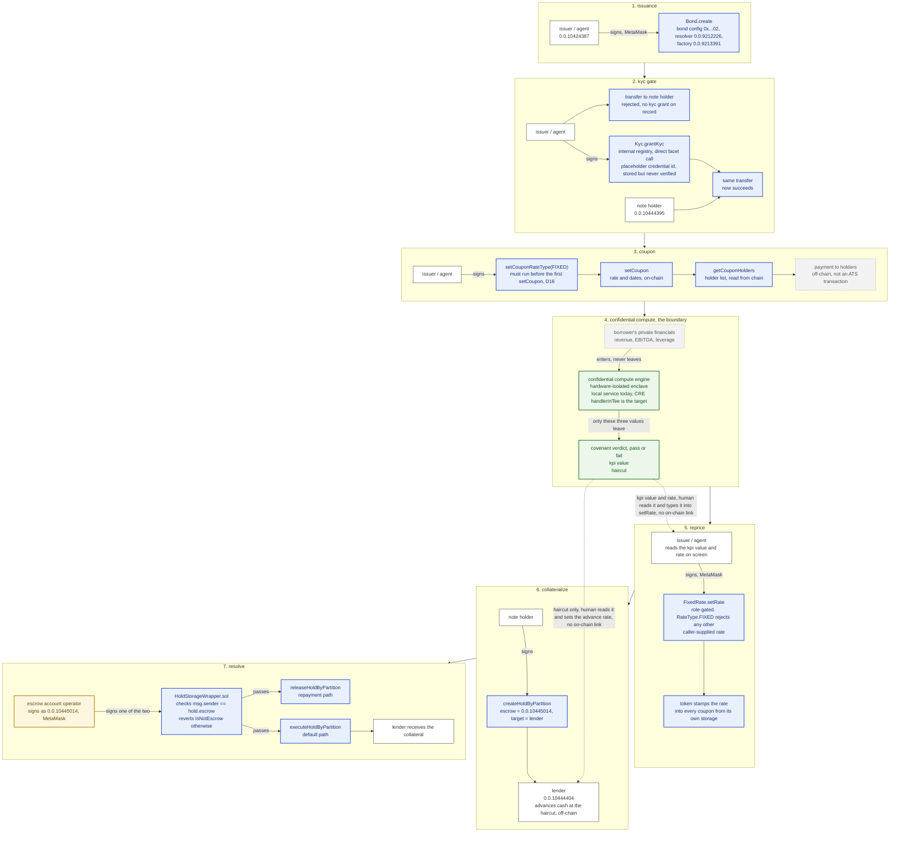

# architecture. where the confidential boundary sits

this diagram exists to answer one question: what enters the enclave, what leaves it, and who
can see each. everything else in the diagram is context for that question.

it also draws a line the submission depends on being honest about: nothing here implies
on-chain verification of the enclave. there is none. a human reads the enclave's output and
signs a transaction. that gap is drawn on purpose, not hidden.

---

## the diagram

**legend.** green: inside the enclave. grey with a dashed border: private, off-chain, or
carried by a human with no cryptographic link to what precedes it. blue: an on-chain
transaction against the ATS diamond on Hedera testnet, through the resolver `0.0.9212226`.
amber: a human operating a designated Hedera account, not the engine acting on its own.

---

## the confidential boundary, in plain terms

the borrower's revenue, EBITDA, total debt, cash and interest expense go into the
confidential compute engine and stop there. nothing crosses back out except three values: a
covenant verdict, a kpi value (net leverage), and a haircut.

the issuer/agent sees the kpi value and the derived rate, because both have to be typed into
`FixedRate.setRate`, but not the financials behind them.

the lender sees the verdict and the haircut only, and that is less private than it first
looks. the haircut is `1500 + 7 * (kpi - 100) + addon` basis points, where the addon is fixed
by the disclosed verdict (0 for a pass, 250 for a watch, 1000 for a breach) and the result is
clamped to a published range. one equation, one unknown: the lender inverts the haircut and
the verdict straight back to the exact net leverage, the same figure the issuer/agent sees.
checked against the demo fixtures: a pass at 2200bps inverts to exactly 2.00x, a breach at
4950bps to exactly 4.50x.

what the lender does not recover is the leverage figure's own inputs. net leverage is
`(total debt - cash) / EBITDA`, one equation in three unknowns, so revenue, EBITDA, total
debt, cash and interest expense all stay unrecoverable even though their ratio does not. the
disclosed verdict adds inequality bounds on the other two covenant tests, interest cover and
EBITDA margin, crossed or not crossed, never a value.

today the engine runs as a plain local service behind a clean interface. the target for the
Chainlink confidential workflow leg is to run the same computation behind a CRE
`handlerInTee`, inside a hardware-isolated enclave, with CRE CLI simulation as the fallback
evidence if the live path does not land in time. **this diagram is true either way.** the
boundary it draws is the same whether the enclave is a genuine TEE-based CRE workflow or a
CRE CLI simulation of one, because in both cases the enclave's output leaves the same way: a
human reads it, then signs.

that last step is the honest part of this diagram. the dashed arrows out of stage 4 are not
transactions. they are a person reading a number off a screen. nothing on Hedera checks that
the rate the issuer/agent typed into `FixedRate.setRate`, or the haircut the lender priced
against, is the number the enclave actually produced. there is no attestation on chain, and no
arrow in this diagram claims there is.

the escrow separation in stage 7 is contract-enforced, which is different in kind from the
relay above it. `HoldStorageWrapper.sol` checks the caller against `hold.escrow` and reverts
`IsNotEscrow` for anyone else. the engine's account, `0.0.10445014`, is a distinct Hedera
account from the issuer/agent's, set once at hold creation and immutable for that hold. that
separation is what stops the issuer/agent from being the one who decides release versus
execute, which is the arrangement this project replaces. it is enforced by the contract, not
by a convention we could quietly break on stage.

## what this diagram deliberately does not draw

- **no arrow from the enclave into the token.** none exists. the engine's output reaches the
  chain only through a person typing a value into a transaction and signing it in MetaMask.
- **no on-chain attestation of the enclave's execution.** nothing on Hedera verifies that the
  published computation is what ran, or that the number a human typed in matches its output.
- **no cash leg for the lender's advance.** the lender pricing and advancing cash at the
  haircut happens off-chain, tracked in the console. the collateral hold moves the note; it
  does not move cash.
- **no push payment for the coupon.** `setCoupon` records terms on-chain and the holder list
  is read from the chain. paying holders is off-chain, not an ATS transaction.
- **no verification behind the KYC grant.** `Kyc.grantKyc` stores a credential identifier the
  contract never checks against anything. granting KYC exercises the token's compliance gate;
  it does not verify anyone's identity.
- **no hash commitment of the engine's output in `Hold.data`.** we considered putting a hash of
  the engine's output into `Hold.data` at `createHoldByPartition`, as an on-chain commitment to
  the exact computation. it is unreachable through the sdk: `RPCTransactionAdapter.ts:1016`
  hardcodes `data: "0x"` and `CreateHoldByPartitionRequest` has no such field. it is reachable
  directly, confirmed by eth_call. we chose not to hand-build calldata for the single most
  load-bearing transaction in the demo to add a commitment that nothing on chain verifies. the
  cost is real; the benefit is presentational.

## why this matters more than it looks

the enclave replaces trust in execution with attestation. it does not touch trust in the
inputs, since the borrower still supplies the revenue and EBITDA figures the engine reads,
and a borrower's incentive to inflate them is larger and more direct than a fund's incentive
to delay marking down its own book. see `PROJECT_BRIEF.md` §4 for the full argument. this diagram is
the visual half of that same claim: it shows exactly where the attestation ends and the human
relay begins, so a reader does not have to take our word for where the line is.
